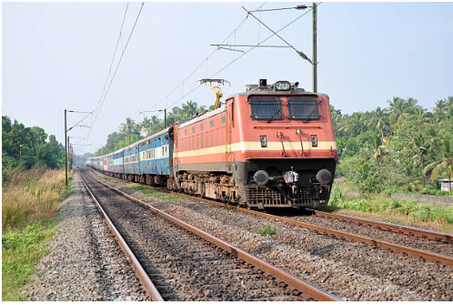
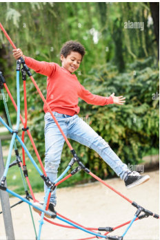
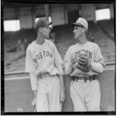
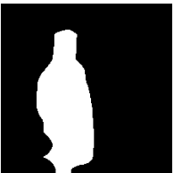
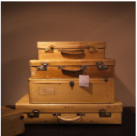
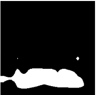

# Contrastive Language Image Pre-training

Collection of Research Paper implementation of various Vision Language models.

Overview

1. CLIP:- A foundational model developed by OpenAI for connecting images and text trained on large amount of image-text pairs. It can recognize various objects based on natural language prompts.

2. CLIPSeg:- An adaptation of CLIP for segmentation tasks enabling pixel level segmentation based on text prompts.

Approach

1. CLIP: 
        Pre-trained Vision Transformer as Image Encoder and DistilBert as Text Encoder

2. CLIPSeg: 
        Custom Decoder on top of pre-trained CLIP

## Results

### CLIP: Image-Text Matching

| Sample Image            | Descriptions                                                                                                   | Predicted Match                    |
|-------------------------|---------------------------------------------------------------------------------------------------------------|-------------------------------|
|  | "A dog playing in the park"   "A train on a track"   "A person riding a skateboard"   "A close-up of a flower in bloom"|"A train on a track"         |
|  | "A dog eating food"  "A train on a track"   "A kid playing in the park"   "A close-up of a flower in bloom" |"A kid playing in the park"         |

### CLIPSeg: Image Segmentation

| Referring Text         | Sample Image            | Predicted Mask          | Ground Truth Mask      |
|------------------------|-------------------------|-------------------------|------------------------|
| "left player" |  |  |  |
| "Bottom case"     |  |  |  |

## References

- **CLIP**: [Radford et al., 2021](https://arxiv.org/pdf/2103.00020) - *Learning Transferable Visual Models From Natural Language Supervision*
- **CLIPSeg**: [Lüddecke et al., 2021](https://arxiv.org/pdf/2112.10003) - *Image Segmentation Using Text and Image Prompts*

